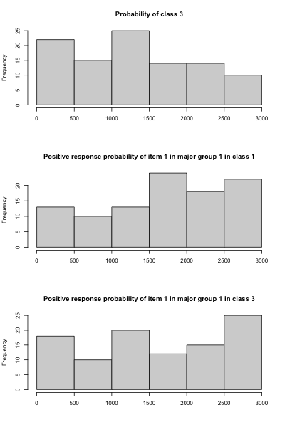

# Summary

One reviewer jamesuanhoro of our JOSS paper pointed us an interesting paper on validating Bayesian algorithms using simulation-based calibration [@talts2018validating]. We implemented the rank statistic metric proposed in this paper to demonstrate that our algorithm is implemented appropriately. 

Recall that our model parameters consist of the following: 1) tree parameters including tree topology, branch lengths, divergence function parameter, and group-specific diffusion variances; 2) latent class model (LCM) parameters including item response probabilities, class probabilities, and class assignment indicators. By definition of the rank statistic metric, if $\tilde \theta$ is a prior sample and $\theta_1, \ldots, \theta_L$ are $L$ posterior samples, we need to count the number of posterior samples smaller than $\tilde \theta$, i.e., $\sum\limits_{l=1}^L \theta_l < \tilde \theta$. With an implicit ordering assumption, this metric is only appropriate for continuous parameters. Therefore, we will only look at the rank statistics of the continuous parameters that are critical for posterior inference, which include the class probabilities and item response probabilities. Since the sampling algorithm in our model is time-consuming, we will simply use the 100 replications in our semi-synthetic data simulation example. Refer to @li2023tree for the data generating mechanism. In each replication, we collect 8000 posterior samples and discard the first 5000 as burn-ins.

Figure 1 displays the distributions (100 data point in each histogram) of the rank statistics of three randomly chosen parameters: the probability of class 3, positive response probability of item 1 in major group 1 in class 1, and Positive response probability of item 1 in major group 1 in class 3. We see that these distributions are approximately uniform, implying that our inference algorithm is valid.

{ width=80% }

# References
