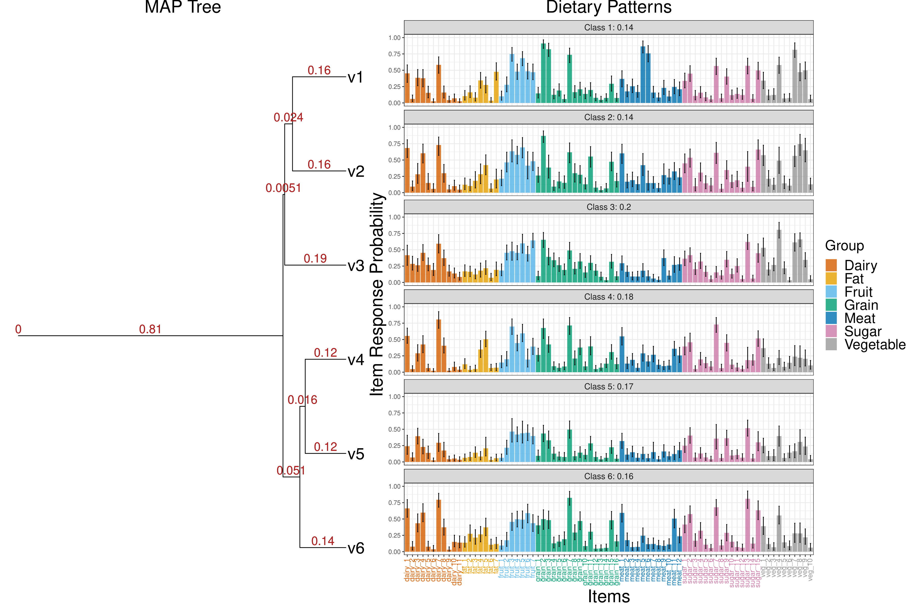

**ddtlcm**: Dirichlet diffusion tree-latent class model (DDT-LCM)

An R package for Tree-regularized latent class mModels with a DDT process prior on class profiles

**Maintainer**: Mengbing Li (mengbing@umich.edu)

**Contributors**: Briana Stephenson (bstephenson@hsph.harvard.edu); Zhenke Wu (zhenkewu@umich.edu)

<!-- **References**: If you are using **lotR** for tree-integrative latent class analysis, 
please cite the following preprint:
 -->

|       | Citation     | Paper Link
| -------------  | -------------  | -------------  |
| Bayesian tree-regularized LCM    | Li M, Stephenson B, Wu Z (2023). Tree-Regularized Bayesian Latent Class Analysis for Improving Weakly Separated Dietary Pattern Subtyping in Small-Sized Subpopulations. *ArXiv:2306.04700*.   |[Link](https://arxiv.org/abs/2306.04700)| 

## Table of content
- [1. Installation](#id-section1)
- [2. Overview](#id-section2)
- [3. Example](#id-section3)

<div id='id-section1'/>

Installation
--------------
```r
# install bioconductor package `ggtree` for visualizing results:
if (!require("BiocManager", quietly = TRUE))
    install.packages("BiocManager")
BiocManager::install("ggtree")

install.packages("devtools",repos="https://cloud.r-project.org")
devtools::install_github("limengbinggz/ddtlcm")
```


<div id='id-section2'/>

Overview
----------
`ddtlcm` is designed for analyzing multivariate binary observations over grouped items in a tree-regularized Bayesian LCM framework. Between-class similarities are guided by an unknown tree, where classes positioned closer on the tree are more similar _a priori_. This framework facilitates the sharing of information between classes to make better estimates of parameters using less data. The model is built upon equipping LCMs with a DDT process prior on the class profiles, with varying degrees of shrinkage across major item groups. The model is particularly promising for addressing weak separation of latent classes when sample sizes are small. The posterior inferential algorithm is based on a hybrid Metropolis-Hastings-within-Gibbs algorithm and can provide posterior uncertainty quantifications.


**ddtlcm** works for 

* multivariate binary responses over pre-specified grouping of items


* The functions' relations in the package `ddtlcm` can be visualized by

```r
library(DependenciesGraphs) # if not installed, try this-- devtools::install_github("datastorm-open/DependenciesGraphs")
library(QualtricsTools) # devtools::install_github("emmamorgan-tufts/QualtricsTools")
dep <- funDependencies('package:ddtlcm','ddtlcm_fit')
plot(dep)
```


<div id='id-section3'/>

Examples 
---------

* A simple [workflow](vignettes/ddtlcm-demo.Rmd) using semi-synthetic data is provided.

* *ddtlcm* estimates the tree over classes and class profiles simultaneously 


A Quickstart
---------
```r
library(ddtlcm)

data(parameter_diet)
# unlist the elements into variables in the global environment
list2env(setNames(parameter_diet, names(parameter_diet)), envir = globalenv()) 

N <- 496
seed_parameter = 1 # random seed to generate node parameters given the tree
seed_response = 1 # random seed to generate multivariate binary observations from LCM

# simulate data given the parameters
sim_data <- simulate_lcm_given_tree(tree_phylo, N, 
    class_probability, item_membership_list, Sigma_by_group, 
    root_node_location = 0, seed_parameter = seed_parameter,
    seed_response = seed_response)

K <- 6 # number of latent classes, same as number of leaves on the tree
result_diet <- ddtlcm_fit(K = K, data = sim_data$response_matrix, 
  item_membership_list = item_membership_list, total_iters = 100)
print(result_diet)
```


Contributing And Getting Help
---------
Please report bugs by opening an [issue](https://github.com/limengbinggz/ddtlcm/issues/new). If you wish to contribute, please make a pull request. If you have questions, you can open a [discussion thread](https://github.com/limengbinggz/ddtlcm/discussions).


Note
---------

* When running some functions in the package, such as ``ddtlcm_fit``, a warning that "Tree contains singleton nodes" may be displayed. This warning originates from the ``checkPhylo4`` function in the phylobase package to perform basic checks on the validity of S4 phylogenetic objects. We would like to point out that seeing such warnings shall not pose any concerns about the statistical validity of the implemented algorithm. This is because any tree generaetd from a DDT process contains a singleton node (having only one child node) as the root node. To avoid repeated appearances of this warning, we recommend either of the followings:

    - Wrapping around the code via ``suppressWarnings({ code_that_will_generate_singleton_warning })``;

    - Setting ``options(warn = -1)`` globally. This may be dangerous because other meaningful warnings may be ignored.


